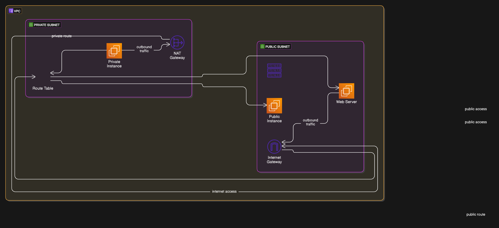

# Secure VPC Deployment Lab

This lab demonstrates how to create a secure Virtual Private Cloud (VPC) using AWS CloudFormation. The VPC includes both public and private subnets, enabling secure deployment of resources while ensuring internet access for specific use cases.

---

## Table of Contents
- [Overview](#overview)
- [Lab Objectives](#lab-objectives)
- [Architecture Overview](#architecture-overview)
- [Key Components](#key-components)
    - [Public Subnet](#public-subnet)
    - [Private Subnet](#private-subnet)
    - [Internet Gateway](#internet-gateway)
    - [NAT Gateway](#nat-gateway)
    - [Route Tables](#route-tables)
    - [Security Groups](#security-groups)
- [How It Works](#how-it-works)
- [Deliverables](#deliverables)
- [Conclusion](#conclusion)

---

##  Overview

In this lab, you will learn how to:
Create a VPC spanning two Availability Zones (AZs).
 Configure public and private subnets with appropriate routing and security settings.
 Deploy an Apache web server in the public subnet and a private instance in the private subnet.
 Enable secure communication between the public and private instances using Session Manager.
Ensure that the private instance has one-way internet access via a NAT Gateway.

---

## Lab Objectives

By completing this lab, you will:
- Gain an understanding of VPC architecture with public and private subnets.
- Learn how to configure networking components such as route tables, Internet Gateways, and NAT Gateways.
- Get hands-on experience deploying EC2 instances securely using CloudFormation.
- Validate connectivity and functionality using tools like Session Manager and ping commands.

---

##  Architecture Overview

The lab creates the following architecture:
- **VPC**: A VPC spanning two Availability Zones (AZs) with CIDR block `10.0.0.0/16`.
- **Public Subnet**: A subnet (`10.0.1.0/24`) in one AZ for hosting publicly accessible resources.
- **Private Subnet**: A subnet (`10.0.2.0/24`) in another AZ for hosting internal resources.
- **Internet Gateway**: Enables internet access for the public subnet.
- **NAT Gateway**: Allows the private subnet to access the internet without exposing it directly.
- **Route Tables**: Define routing rules for public and private subnets.
- **Security Groups**: Control inbound and outbound traffic for EC2 instances.
- **EC2 Instances**:
    - A web server in the public subnet running Apache.
    - A private instance in the private subnet.

---

##  Key Components

###  Public Subnet
- **Purpose**: Hosts resources that need to be directly accessible from the internet, such as web servers.
- **Features**:
    - Automatically assigns public IP addresses to instances.
    - Routes all outbound traffic (`0.0.0.0/0`) to the Internet Gateway.
    - Security groups allow HTTP (port 80) and SSH (port 22) traffic.

###  Private Subnet
- **Purpose**: Hosts internal resources that should not be directly exposed to the internet.
- **Features**:
    - Does not assign public IP addresses to instances.
    - Routes all outbound traffic (`0.0.0.0/0`) to the NAT Gateway.
    - Security groups allow SSH traffic only from the web server's security group.

### Internet Gateway
- **Purpose**: Provides internet access for the public subnet.
- **Functionality**:
    - Acts as the entry and exit point for internet-bound traffic in the VPC.
    - Attached to the VPC and associated with the public route table.

###  NAT Gateway
- **Purpose**: Enables instances in the private subnet to access the internet without exposing them directly.
- **Functionality**:
    - Uses an Elastic IP address to translate private IP addresses to a public IP address.
    - Configured in the public subnet and associated with the private route table.

### Route Tables
- **Public Route Table**: Routes all outbound traffic (`0.0.0.0/0`) to the Internet Gateway.
- **Private Route Table**: Routes all outbound traffic (`0.0.0.0/0`) to the NAT Gateway.

###  Security Groups
- **Web Server Security Group**: Allows inbound HTTP (port 80) and SSH (port 22) traffic from `0.0.0.0/0`.
- **Private Instance Security Group**: Allows inbound SSH traffic only from the web server's security group.

---

##  How It Works

### Public Subnet
- The web server in the public subnet has a public IP address and can communicate directly with the internet via the Internet Gateway.
- Users can access the web server via its public IP or DNS name.

###  Private Subnet
- The private instance does not have a public IP address and cannot be accessed directly from the internet.
- Outbound traffic from the private instance is routed through the NAT Gateway, which translates the private IP address to a public IP address.

###  Communication Between Subnets
- The web server can SSH into the private instance using **Session Manager**.
- The private instance can **ping external websites** via the NAT Gateway.

---

##  Deliverables

 CloudFormation template for VPC with public and private subnets.
 Deployed EC2 instances with appropriate security settings.
 Verified connectivity and functionality between instances.

---

##  Conclusion

This lab provides a comprehensive guide to deploying a **secure VPC** with **public and private subnets** using **AWS CloudFormation**. By following the steps outlined, you will gain practical experience in configuring and managing VPC components, ensuring secure and efficient deployment of resources.